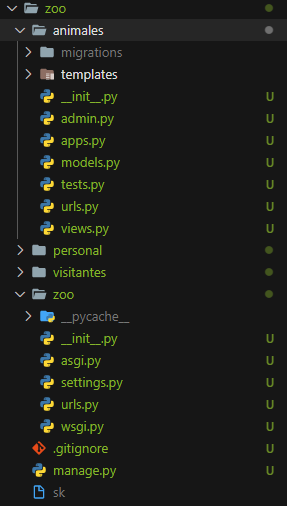
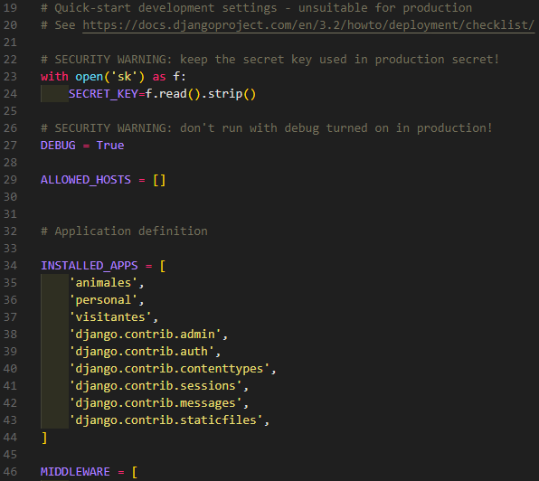

# Django project script
#### _Script para automatizar la creación de projectos en Django_

Script creado en python para automatizar la creación de projectos y apps* en django, junto con proteger la security key y generar el archivo gitignore.
*_la creación de apps es opcional y no hay limite de cuantas app se pueden ingresar como argumento_


## Caracteristicas

- Crea el proyecto.
- Proteje la security key en un archivo externo llamado sk que se ubica en la raiz del proyecto.
- Crea las apps indicadas junto a su carpeta templates y archivo urls.
- Agrega las apps creadas en el archivo settings.
- Se puede utilizar en Windows, Linux y Mac

## Uso

El script requiere [python](https://www.python.org/) v3.5 o superior para correr.

#### Ejemplos de uso

- Crear solo el projecto.
   ```sh
    python django_project_creation.py nombre_projecto
    ```
- Creación de projecto y una app
    ```sh
    python django_project_creation.py nombre_projecto nombre_app
    ```
- Creación de projecto y varias apps
    ```sh
    python django_project_creation.py nombre_projecto nombre_app nombre_app nombre_app
    ```

## Vista Previa
A continuación se muestra el resultado del script creando el projecto "_zoo_" junto a las apps "_animales_", "_personal_" y "_visitantes_".
```sh
python django_project_creation.py zoo animales personal visitantes
```
- **Estructura del proyecto resultante**



- **Archivo setting resultante**


